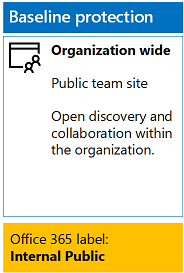
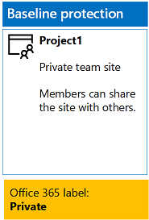
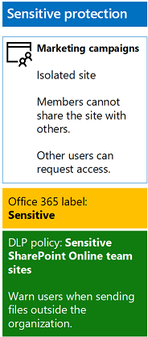
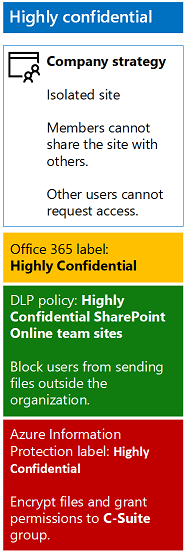

# <a name="secure-sharepoint-online-sites-in-a-devtest-environment"></a>개발/테스트 환경의 SharePoint Online 사이트 보호

## <a name="introduction"></a>소개

이 문서에서는 [SharePoint Online 사이트 및 파일 보호 솔루션](secure-sharepoint-online-sites-and-files.md)에 대한 네 가지 유형의 SharePoint Online 팀 사이트를 포함하는 개발/테스트 환경을 만드는 단계별 지침을 제공합니다.

이 개발/테스트 환경을 사용하여 프로덕션 환경에 SharePoint Online 팀 사이트를 배포하기 전에 정보 보호 동작을 실험하고 특정 요구 사항에 맞게 설정을 자세히 조정합니다.

## <a name="phase-1-create-your-devtest-environment"></a>1단계: 개발/테스트 환경 만들기
이 단계에서는 가상의 조직을 위해 Office 365 및 Enterprise Mobility + Security에 대한 평가판 구독을 얻습니다.

먼저 [Office 365 개발/테스트 환경](https://technet.microsoft.com/library/mt736406.aspx)의 **2단계**에 있는 지침을 따릅니다.

그런 다음 **EMS 평가판 구독**에 등록하고, Office 365 평가판 구독과 동일한 조직에 추가한 후, 다음 단계를 수행합니다.

1. 필요한 경우 평가판 구독의 전역 관리자 계정 자격 증명으로 **Office 365 포털**에 로그인합니다. 도움을 받으려면 [Office 365에 로그인하는 위치](https://support.office.com/Article/Where-to-sign-in-to-Office-365-e9eb7d51-5430-4929-91ab-6157c5a050b4)를 참조하세요.
2. **관리** 타일을 클릭합니다.
3. 브라우저의 **Office 관리 센터** 탭에 있는 왼쪽 탐색 영역에서 **대금 청구 > 서비스 구매**를 차례로 클릭합니다.
4. **서비스 구매** 페이지에서 **Enterprise Mobility + Security E5** 항목을 찾은 다음 마우스 포인터로 해당 항목 위를 가리켜 **평가판 시작**을 클릭합니다.
5. **주문 확인** 페이지에서 **지금 평가판 사용**을 클릭합니다.
6. **주문 접수** 페이지에서 **계속**을 클릭합니다.

그런 다음 전역 관리자 계정에 대해 Enterprise Mobility + Security E5 라이선스를 사용하도록 설정합니다.

1. 브라우저의 **Office 365 관리 센터** 탭에 있는 왼쪽 탐색 영역에서 **사용자 > 활성 사용자**를 차례로 클릭합니다.
2. 전역 관리자 계정을 클릭한 다음 **제품 라이선스 편집**을 클릭합니다.
3. **제품 라이선스** 창에서 **Enterprise Mobility + Security E5**의 제품 라이선스를 **설정**으로 지정하고, **저장**을 클릭하고, **닫기**를 두 번 클릭합니다.


## <a name="phase-2-create-and-configure-your-azure-active-directory-ad-groups-and-users"></a>2단계: Azure AD(Active Directory) 그룹 및 사용자 만들기 및 구성
이 단계에서는 가상의 조직에 대한 Azure AD 그룹 및 사용자를 만들고 구성합니다.

먼저 [Azure Active Directory V2 PowerShell 모듈에 연결](https://go.microsoft.com/fwlink/?linkid=842218)해야 합니다.

그런 다음 PowerShell 명령 프롬프트 또는 ISE(Integrated Script Environment)에서 다음 명령을 실행합니다.
```
$groupNames=@("C-Suite","IT staff","Research staff","Regular staff","Marketing staff","Sales staff")
ForEach ($element in $groupNames){ New-AzureADGroup -DisplayName $element -MailEnabled $false -SecurityEnabled $true -MailNickName "NotSet" }
```

그런 다음 그룹 구성원에게 Office 365 및 EMS 구독에 대한 라이선스를 자동으로 할당하도록 자동 라이선스를 구성한 후 다음 단계를 수행합니다.

1. 브라우저에 별도의 탭을 만든 다음 [https://portal.azure.com](https://portal.azure.com)의 **Azure Portal**로 이동합니다. 필요한 경우 Office 365 E5 평가판 구독에 대한 전역 관리자 계정의 자격 증명으로 로그인합니다.
2. Azure Portal에서 **Azure Active Directory > 라이선스 > 모든 제품**을 차례로 클릭합니다.
3. 목록에서 **Enterprise Mobility + Security E5** 및 **Office 365 Enterprise E5**를 선택하고 **할당**을 클릭합니다.
4. **라이선스 할당** 블레이드에서 **사용자 및 그룹**을 클릭합니다.
5. 그룹 목록에서 다음을 선택합니다.
 * C-Suite
 * IT 직원
 * 연구 직원
 * 일반 직원
 * 마케팅 직원
 * 판매 직원
6. **선택**을 클릭하고 **할당**을 클릭합니다.
7. 브라우저에서 Azure Portal 탭을 닫습니다.

그런 다음 조직 이름, 사용자 위치 및 공통 암호를 입력합니다. PowerShell 명령 프롬프트 또는 ISE(Integrated Script Environment)에서 아래 명령을 실행하여 사용자 계정을 만듭니다. 그런 다음 해당 그룹에 추가합니다.

```
$orgName="[organization name, such as contoso for the contoso.onmicrosoft.com trial subscription domain name]"
$location="[the ISO ALPHA2 country code, such as US for the United States]"
$commonPassword="[common password for all the new accounts]"

$PasswordProfile=New-Object -TypeName Microsoft.Open.AzureAD.Model.PasswordProfile
$PasswordProfile.Password=$commonPassword

$groupName="C-Suite"
$userNames=@("CEO","CFO","CIO")
$groupID=(Get-AzureADGroup | Where { $_.DisplayName -eq $groupName }).ObjectID
ForEach ($element in $userNames){
New-AzureADUser -DisplayName $element -PasswordProfile $PasswordProfile -UserPrincipalName ($element + "@" + $orgName + ".onmicrosoft.com") -AccountEnabled $true -MailNickName $element -UsageLocation $location
Add-AzureADGroupMember -RefObjectId (Get-AzureADUser | Where { $_.DisplayName -eq $element }).ObjectID -ObjectId $groupID
}
$groupName="IT staff"
$userNames=@("ITAdmin1","ITAdmin2")
$groupID=(Get-AzureADGroup | Where { $_.DisplayName -eq $groupName }).ObjectID
ForEach ($element in $userNames){
New-AzureADUser -DisplayName $element -PasswordProfile $PasswordProfile -UserPrincipalName ($element + "@" + $orgName + ".onmicrosoft.com") -AccountEnabled $true -MailNickName $element -UsageLocation $location
Add-AzureADGroupMember -RefObjectId (Get-AzureADUser | Where { $_.DisplayName -eq $element }).ObjectID -ObjectId $groupID
}
$groupName="Research staff"
$userNames=@("Researcher1")
$groupID=(Get-AzureADGroup | Where { $_.DisplayName -eq $groupName }).ObjectID
ForEach ($element in $userNames){
New-AzureADUser -DisplayName $element -PasswordProfile $PasswordProfile -UserPrincipalName ($element + "@" + $orgName + ".onmicrosoft.com") -AccountEnabled $true -MailNickName $element -UsageLocation $location
Add-AzureADGroupMember -RefObjectId (Get-AzureADUser | Where { $_.DisplayName -eq $element }).ObjectID -ObjectId $groupID
}
$groupName="Regular staff"
$userNames=@("Regular1", "Regular2")
$groupID=(Get-AzureADGroup | Where { $_.DisplayName -eq $groupName }).ObjectID
ForEach ($element in $userNames){
New-AzureADUser -DisplayName $element -PasswordProfile $PasswordProfile -UserPrincipalName ($element + "@" + $orgName + ".onmicrosoft.com") -AccountEnabled $true -MailNickName $element -UsageLocation $location
Add-AzureADGroupMember -RefObjectId (Get-AzureADUser | Where { $_.DisplayName -eq $element }).ObjectID -ObjectId $groupID
}
$groupName="Marketing staff"
$userNames=@("Marketing1", "Marketing2")
$groupID=(Get-AzureADGroup | Where { $_.DisplayName -eq $groupName }).ObjectID
ForEach ($element in $userNames){
New-AzureADUser -DisplayName $element -PasswordProfile $PasswordProfile -UserPrincipalName ($element + "@" + $orgName + ".onmicrosoft.com") -AccountEnabled $true -MailNickName $element -UsageLocation $location
Add-AzureADGroupMember -RefObjectId (Get-AzureADUser | Where { $_.DisplayName -eq $element }).ObjectID -ObjectId $groupID
}
$groupName="Sales staff"
$userNames=@("SalesPerson1")
$groupID=(Get-AzureADGroup | Where { $_.DisplayName -eq $groupName }).ObjectID
ForEach ($element in $userNames){
New-AzureADUser -DisplayName $element -PasswordProfile $PasswordProfile -UserPrincipalName ($element + "@" + $orgName + ".onmicrosoft.com") -AccountEnabled $true -MailNickName $element -UsageLocation $location
Add-AzureADGroupMember -RefObjectId (Get-AzureADUser | Where { $_.DisplayName -eq $element }).ObjectID -ObjectId $groupID
}
```

>[!Note]
>여기서 공통 암호를 사용하는 것은 자동화 및 개발/테스트 환경에 대한 구성 용이성을 위한 것입니다. 프로덕션 구독에는 권장되지 않습니다.
>

그런 다음 아래 단계에 따라 그룹 기반 라이선스가 제대로 작동하는지 확인합니다.

1. 브라우저의 **Microsoft Office 홈** 탭에서 **관리** 타일을 클릭합니다.
2. 브라우저의 새 **Office 관리 센터** 탭에서 **사용자**를 클릭합니다.
3. 사용자 목록에서 **CEO**를 클릭합니다.
4. **CEO** 사용자 계정의 속성을 나열하는 창의 **제품 라이선스**에서 **Enterprise Mobility + Security E5** 및 **Office 365 Enterprise E5** 라이선스가 할당되었는지 확인합니다.

## <a name="phase-3-create-office-365-labels"></a>3단계: Office 365 레이블 만들기

이 단계에서는 SharePoint Online 팀 사이트에 있는 문서 폴더의 다양한 보안 수준에 대한 레이블을 만듭니다.

1. 필요한 경우 인터넷 브라우저의 개인 인스턴스를 사용하고, Office 365 E5 평가판 구독의 전역 관리자 계정으로 **Office 365 포털**에 로그인합니다. 도움을 받으려면 [Office 365에 로그인하는 위치](https://support.office.com/Article/Where-to-sign-in-to-Office-365-e9eb7d51-5430-4929-91ab-6157c5a050b4)를 참조하세요.
2. **Microsoft Office 홈** 탭에서 **관리** 타일을 클릭합니다.
3. 브라우저의 새 **Office 관리 센터** 탭에서 **관리 센터 > 보안 및 준수**를 차례로 클릭합니다.
4. 브라우저의 새 **홈 - 보안 및 준수** 탭에서 **분류 > 레이블**을 차례로 클릭합니다.
5. **홈 > 레이블** 창에서 **레이블 만들기**를 클릭합니다.
 1. **레이블 이름 지정** 창에서 **내부 공용**을 입력하고 **다음**을 클릭합니다.
 2. **레이블 설정** 창에서 **다음**을 클릭합니다.
 3. **설정 검토** 창에서 **이 레이블 만들기**, **닫기**를 차례로 클릭합니다.
6. 다음과 같은 추가 레이블에 대해 위의 단계를 반복합니다.
 * 개인
 * 중요
 * 극비
7. **홈 > 레이블**  창에서 **레이블 게시**를 클릭합니다.
8. **게시할 레이블 선택** 창에서 **게시할 레이블 선택**을 클릭합니다.
9. **레이블 선택** 창에서 **추가**를 클릭하고, 네 가지 레이블을 모두 선택하고, **완료**를 클릭합니다.
10. **게시할 레이블 선택** 창에서 **다음**을 클릭합니다.
11. **위치 선택** 창에서 **다음**을 클릭합니다.
12. **정책 이름 지정** 창에서 **이름**에 **예제 조직**을 입력하고 **다음**을 클릭합니다.
13. **설정 검토** 창에서 **레이블 게시**, **닫기**를 차례로 클릭합니다.

## <a name="phase-4-create-your-sharepoint-online-team-sites"></a>4단계: SharePoint Online 팀 사이트 만들기
이 단계에서는 예제 조직에 대한 네 가지 유형의 SharePoint Online 팀 사이트를 만들고 구성합니다.

### <a name="organization-wide-team-site"></a>조직 수준 팀 사이트
초기 공용 SharePoint Online 팀 사이트를 만들려면 다음을 수행합니다.

1. 필요한 경우 로컬 컴퓨터에서 브라우저를 사용하여 전역 관리자 계정으로 Office 365 포털에 로그인합니다. 도움을 받으려면 [Office 365에 로그인하는 위치](https://support.office.com/Article/Where-to-sign-in-to-Office-365-e9eb7d51-5430-4929-91ab-6157c5a050b4)를 참조하세요.
2. 타일 목록에서 **SharePoint**를 클릭합니다.
3. 브라우저의 새 **SharePoint** 탭에서 **+ 사이트 만들기**를 클릭합니다.
4. **사이트 만들기** 페이지에서 **팀 사이트**를 클릭합니다.
5. **사이트 이름**에서 **조직 수준**을 입력합니다.
6. **팀 사이트 설명**에서 **전체 조직에 대한 SharePoint 사이트**를 입력합니다.
7. **개인 정보 설정**에서 **Public – anyone in the organization can access this site(공용 - 조직의 모든 사용자가 이 사이트에 액세스할 수 있음)**을 선택하고 **다음**을 클릭합니다.
8. **Who do you want to add?(누구를 추가하시겠습니까?)** 창에서 **마침**을 클릭합니다.

그런 다음 조직 수준 팀 사이트의 문서 폴더를 내부 공용 레이블로 구성합니다.

1. 브라우저의 **조직 수준 - 홈** 탭에서 **문서**를 클릭합니다.
2. 설정 아이콘을 클릭한 다음 **라이브러리 설정**을 클릭합니다.
3. **권한 및 관리** 아래에서 **Apply label to items in this library(이 라이브러리의 항목에 레이블 적용)**을 클릭합니다.
4. **설정 - 레이블 적용**에서 **내부 공용**을 선택하고 **저장**을 클릭합니다.

결과적으로 구성은 다음과 같습니다.

 

### <a name="project-1-team-site"></a>프로젝트 1 팀 사이트
조직 내에서 프로젝트에 대한 초기 개인 SharePoint Online 팀 사이트를 만들려면 다음을 수행합니다.

1. 필요한 경우 로컬 컴퓨터에서 브라우저를 사용하여 전역 관리자 계정으로 **Office 365 포털**에 로그인합니다. 도움을 받으려면 [Office 365에 로그인하는 위치](https://support.office.com/Article/Where-to-sign-in-to-Office-365-e9eb7d51-5430-4929-91ab-6157c5a050b4)를 참조하세요.
2. 타일 목록에서 **SharePoint**를 클릭합니다.
3. 브라우저의 새 **SharePoint** 탭에서 **+ 사이트 만들기**를 클릭합니다.
4. **사이트 만들기** 페이지에서 **팀 사이트**를 클릭합니다.
5. **사이트 이름**에서 **프로젝트 1**을 입력합니다.
6. **팀 사이트 설명**에서 **프로젝트 1에 대한 SharePoint 사이트**를 입력합니다.
7. **개인 정보 설정**에서 **Private – only members can access this site(개인 - 구성원만 이 사이트에 액세스할 수 있음)**를 선택하고 **다음**을 클릭합니다.
8. **Who do you want to add?(누구를 추가하시겠습니까?)** 창에서 **마침**을 클릭합니다.

그런 다음 프로젝트 1 팀 사이트의 문서 폴더를 개인 레이블로 구성합니다.

1. 브라우저의 **프로젝트 1 - 홈** 탭에서 **문서**를 클릭합니다.
2. 설정 아이콘을 클릭한 다음 **라이브러리 설정**을 클릭합니다.
3. **권한 및 관리** 아래에서 **Apply label to items in this library(이 라이브러리의 항목에 레이블 적용)**을 클릭합니다.
4. **설정 - 레이블 적용**에서 **개인**을 선택하고 **저장**을 클릭합니다.

결과적으로 구성은 다음과 같습니다.

 

### <a name="marketing-campaigns-team-site"></a>마케팅 캠페인 팀 사이트

마케팅 캠페인 리소스에 대해 격리된 중요 수준 SharePoint Online 팀 사이트를 만들려면 다음을 수행합니다.

1. 로컬 컴퓨터에서 브라우저를 사용하여 전역 관리자 계정으로 **Office 365 포털**에 로그인합니다. 도움을 받으려면 [Office 365에 로그인하는 위치](https://support.office.com/Article/Where-to-sign-in-to-Office-365-e9eb7d51-5430-4929-91ab-6157c5a050b4)를 참조하세요.
2. 타일 목록에서 **SharePoint**를 클릭합니다.
 1. 브라우저의 새 **SharePoint** 탭에서 **+ 사이트 만들기**를 클릭합니다.
 2. **사이트 만들기** 페이지에서 **팀 사이트**를 클릭합니다.
3. **팀 사이트 이름**에서 **마케팅 캠페인**을 입력합니다.
4. **팀 사이트 설명**에서 **마케팅 캠페인 리소스(중요)에 대한 SharePoint 사이트**를 입력합니다.
5. **개인 정보 설정**에서 **Private – only members can access this site(개인 - 구성원만 이 사이트에 액세스할 수 있음)**를 선택하고 **다음**을 클릭합니다.
6. **Who do you want to add?(누구를 추가하시겠습니까?)** 창에서 **마침**을 클릭합니다.
7. 브라우저의 새 **마케팅 캠페인** 탭에 있는 도구 모음에서 설정 아이콘을 클릭하고 **사이트 권한**을 클릭합니다.
8. **사이트 권한** 창에서 **고급 권한 설정**을 클릭합니다.
9. 브라우저의 새 **권한** 탭에서 **액세스 요청 설정**을 클릭합니다.
10. **액세스 요청 설정** 대화 상자에서 다음을 수행합니다.
  1. **구성원이 사이트와 개별 파일 및 폴더를 공유할 수 있도록 허용합니다.** 및 **구성원이 다른 사용자들을 사이트 구성원 그룹에 초대할 수 있도록 허용합니다.** 확인란의 선택을 취소합니다.
  2. **모든 액세스 요청 보내기**에서 **ITAdmin1@[your organization name].onmicrosoft.com**을 입력합니다.
  3. **확인**을 클릭합니다.
11. 목록에서 **마케팅 캠페인 구성원**을 클릭합니다.
12. **사용자 및 그룹** 페이지에서 **새로 만들기**를 클릭합니다.
13. **공유** 대화 상자에서 **마케팅 직원**을 입력하고, 해당 항목을 선택하고, **공유**를 클릭합니다.
14. **Researcher1** 사용자 계정에 대해 위의 단계를 반복합니다.
15. 브라우저에서 [뒤로] 단추를 클릭하고 목록에서 **마케팅 캠페인 소유자**를 클릭합니다.
16. **사용자 및 그룹** 페이지에서 **새로 만들기**를 클릭합니다.
17. **공유** 대화 상자에서 **IT 직원**을 입력하고, 해당 항목을 선택하고, **공유**를 클릭합니다.
18. 브라우저에서 [뒤로] 단추를 클릭하고, 브라우저의 **사용자 및 그룹** 탭을 닫고, 브라우저에서 **마케팅 캠페인 - 홈** 탭을 클릭하고, **사이트 권한** 창을 닫습니다.

권한 구성의 결과는 다음과 같습니다.

* **마케팅 캠페인 - 구성원** SharePoint 그룹에는 **마케팅 캠페인** 그룹(전역 관리자 사용자 계정 포함), **마케팅 직원** 그룹(Marketing1 및 Marketing2 사용자 계정) 및 **Researcher1** 사용자 계정만 있습니다.
* **마케팅 캠페인 - 소유자** SharePoint 그룹에는 **IT 직원** 그룹(ITAdmin1 및 ITAdmin2 사용자 계정만 포함) 그룹만 있습니다.
* **마케팅 캠페인 - 방문자** SharePoint 그룹에는 그룹 또는 사용자 계정이 없습니다.
* 구성원은 사이트 수준 권한을 수정할 수 없습니다(이 작업은 **마케팅 캠페인 - 소유자** 그룹의 구성원만 수행할 수 있음).
* 다른 사용자 계정은 사이트 또는 해당 리소스에 액세스할 수 없지만, 해당 사이트에 대한 액세스는 요청할 수 있으며, 이 사이트에서 _ITAdmin1_ 사용자 계정 사서함으로 전자 메일을 보냅니다.

그런 다음 마케팅 캠페인 팀 사이트의 문서 폴더를 중요 레이블로 구성합니다.

1. 브라우저의 **마케팅 캠페인 - 홈** 탭에서 **문서**를 클릭합니다.
2. 설정 아이콘을 클릭한 다음 **라이브러리 설정**을 클릭합니다.
3. **권한 및 관리** 아래에서 **Apply label to items in this library(이 라이브러리의 항목에 레이블 적용)**을 클릭합니다.
4. **설정 - 레이블 적용**에서 **중요**를 선택하고 **저장**을 클릭합니다.

그런 다음 마케팅 캠페인 사이트가 포함된 중요 레이블을 사용하여 SharePoint Online 팀 사이트에서 조직 외부와 문서를 공유할 때 사용자에게 알리는 DLP(데이터 손실 방지) 정책을 구성합니다.

1. 브라우저의 **Microsoft Office 홈** 탭에서 **보안 및 준수 센터** 타일을 클릭합니다.
2. 브라우저의 새 **보안 및 준수** 탭에서 **데이터 손실 방지 > 정책**을 차례로 클릭합니다.
3. **데이터 손실 방지** 창에서 **+ 정책 만들기**를 클릭합니다.
4. **Start with a template or create a custom policy(템플릿으로 시작하거나 사용자 지정 정책 만들기)** 창에서 **사용자 지정**, **다음**을 차례로 클릭합니다.
5. **정책 이름 지정** 창의 **이름**에서 **중요 레이블 SharePoint Online 팀 사이트**를 입력하고 **다음**을 클릭합니다.
6. **위치 선택** 창에서 **Let me choose specific locations(특정 위치 직접 선택)**를 선택하고 **다음**을 클릭합니다.
7. 위치 목록에서 **Exchange 전자 메일** 및 **OneDrive 계정** 위치를 사용하지 않도록 설정하고 **다음**을 클릭합니다.
8. **Customize the types of sensitive info you want to protect(보호할 중요 정보 유형 사용자 지정)** 창에서 **편집**을 클릭합니다.
9. **Choose the types of content to protect(보호할 콘텐츠 형식 선택)** 창의 드롭다운 상자에서 **추가**, **레이블**을 차례로 클릭합니다.
10. **레이블** 창에서 **+ 추가**를 클릭하고, **중요** 레이블을 선택하고, **추가**를 클릭한 다음 **완료**를 클릭합니다.
11. **Choose the types of content to protect(보호할 콘텐츠 형식 선택)** 창에서 **저장**을 클릭합니다.
12. **Customize the types of sensitive info you want to protect(보호할 중요 정보 유형 사용자 지정)** 창에서 **다음**을 클릭합니다.
13. **중요한 정보를 발견하면**  창에서 **팁 및 전자 메일 사용자 지정**을 클릭합니다.
14. **Customize policy tips and email notifications(정책 팁 및 전자 메일 알림 사용자 지정)** 창에서 **Customize the policy tip text(정책 팁 텍스트 사용자 지정)**를 클릭합니다.
15. 텍스트 상자에서 다음과 같이 입력하거나 붙여넣은 다음 **확인**을 클릭합니다.
 * 조직 외부의 사용자와 공유하려면 파일을 다운로드한 다음 파일을 엽니다. **파일**, **문서 보호**, **암호 설정**을 차례로 클릭한 다음 강력한 암호를 지정합니다. 암호를 별도의 전자 메일 또는 다른 통신 수단으로 보냅니다.
16. **What do you want to do if we detect sensitive info?(중요 정보를 검색하는 경우 어떤 작업을 수행하시겠습니까?)** 창에서 **Block people from sharing and restrict access to shared content(공유된 콘텐츠 차단 및 액세스 제한)** 확인란의 선택을 취소하고 **다음**을 클릭합니다.
17. **Do you want to turn on the policy or test things out first?(먼저 정책을 사용하도록 설정하거나 테스트하시겠습니까?)** 창에서 **예**를 클릭하는 대로 사용하도록 설정하고 **다음**을 클릭합니다.
18. **설정 검토** 창에서 **만들기**, **닫기**를 차례로 클릭합니다.

결과적으로 구성은 다음과 같습니다.

 

### <a name="company-strategy-team-site"></a>회사 전략 팀 사이트
조직의 최고 경영자(CEO)의 전략적 회사 리소스에 대해 격리된 극비 수준의 SharePoint Online 팀 사이트를 만들려면 다음을 수행합니다.

1. 필요한 경우 로컬 컴퓨터에서 브라우저를 사용하여 전역 관리자 계정으로 **Office 365 포털**에 로그인합니다. 도움을 받으려면 [Office 365에 로그인하는 위치](https://support.office.com/Article/Where-to-sign-in-to-Office-365-e9eb7d51-5430-4929-91ab-6157c5a050b4)를 참조하세요.
2. 타일 목록에서 **SharePoint**를 클릭합니다.
3. 브라우저의 새 **SharePoint 탭**에서 **+ 사이트 만들기**를 클릭합니다.
  1. **사이트 만들기** 페이지에서 **팀 사이트**를 클릭합니다.
  2. **팀 사이트 이름**에서 **회사 전략**을 입력합니다.
  3. **팀 사이트 설명**에서 **회사 전략(극비)에 대한 SharePoint 사이트**를 입력합니다.
4. **개인 정보 설정**에서 **Private – only members can access this site(개인 - 구성원만 이 사이트에 액세스할 수 있음)**를 선택하고 **다음**을 클릭합니다.
5. **Who do you want to add?(누구를 추가하시겠습니까?)** 창에서 **마침**을 클릭합니다.
6. 브라우저의 새 **회사 전략** 탭에 있는 도구 모음에서 설정 아이콘을 클릭하고 **사이트 권한**을 클릭합니다.
7. **사이트 권한** 창에서 **고급 권한 설정**을 클릭합니다.
8. 브라우저의 새 **권한** 탭에서 **액세스 요청 설정**을 클릭합니다.
9. **액세스 요청 설정** 대화 상자에서 **구성원이 사이트와 개별 파일 및 폴더를 공유할 수 있도록 허용합니다.** 및 **구성원이 다른 사용자들을 사이트 구성원 그룹에 초대할 수 있도록 허용합니다.** 확인란의 선택을 취소하고(3개 확인란이 모두 선택 취소됨) **확인**을 클릭합니다.
10. 목록에서 **회사 전략 구성원**을 클릭하고 **사용자 및 그룹** 페이지에서 **새로 만들기**를 클릭합니다.
11. **공유** 대화 상자에서 **C-Suite**를 입력하고, 해당 항목을 선택하고, **공유**를 클릭합니다.
12. 목록에서 **회사 전략 소유자**를 클릭하고 **사용자 및 그룹** 페이지에서 **새로 만들기**를 클릭합니다.
13. **공유** 대화 상자에서 **IT 직원**을 입력하고, 해당 항목을 선택하고, **공유**를 클릭합니다.
14. 브라우저에서 [뒤로] 단추를 클릭하고 **사용자 및 그룹** 탭을 닫습니다.
15. 브라우저에서 **회사 전략 - 홈** 탭을 클릭한 다음 **사이트 권한** 창을 닫습니다.

권한 구성의 결과는 다음과 같습니다.

* **회사 전략 - 구성원** SharePoint 그룹에는 **C-Suite** 그룹(CEO, CFO 및 CIO 사용자 계정만 포함) 및 **회사 전략** 그룹(전역 관리자 사용자 계정만 포함)만 있습니다.
* **회사 전략 - 소유자** SharePoint 그룹에는 **IT 직원** 그룹(_ITAdmin1_ 및 _ITAdmin2_ 사용자 계정만 포함) 그룹만 있습니다.
* **회사 전략 - 방문자** SharePoint 그룹에는 그룹 또는 사용자 계정이 없습니다.
* 구성원은 사이트 수준 권한을 수정할 수 없습니다(이 작업은 **회사 전략 - 소유자** 그룹의 구성원만 수행할 수 있음).
* 다른 사용자 계정은 사이트 또는 해당 리소스에 액세스하거나 사이트에 대한 액세스를 요청할 수 없습니다. 사이트에 대한 추가 권한은 전역 관리자 또는 **회사 전략 - 소유자** 그룹의 구성원이 수행해야 합니다.

그런 다음 회사 전략 팀 사이트의 문서 폴더를 극비 레이블로 구성합니다.

1. 브라우저의 **회사 전략 - 홈** 탭에서 **문서**를 클릭합니다.
2. 설정 아이콘을 클릭한 다음 **라이브러리 설정**을 클릭합니다.
3. **권한 및 관리** 아래에서 **Apply label to items in this library(이 라이브러리의 항목에 레이블 적용)**을 클릭합니다.
4. **설정 - 레이블 적용**에서 **극비**를 선택하고 **저장**을 클릭합니다.

그런 다음 회사 전략 사이트가 포함된 극비 레이블을 사용하여 SharePoint Online 팀 사이트에서 조직 외부와 문서를 공유할 때 사용자를 차단하는 DLP 정책을 구성합니다.

1. 필요한 경우 로컬 컴퓨터에서 브라우저를 사용하여 보안 관리자 또는 회사 관리자 역할이 있는 계정으로 **Office 365 포털**에 로그인합니다. 도움을 받으려면 [Office 365에 로그인하는 위치](https://support.office.com/Article/Where-to-sign-in-to-Office-365-e9eb7d51-5430-4929-91ab-6157c5a050b4)를 참조하세요.
2. 브라우저의 **Microsoft Office 홈** 탭에서 **보안 및 준수 센터** 타일을 클릭합니다.
3. 브라우저의 새 **보안 및 준수** 탭에서 **데이터 손실 방지 > 정책**을 차례로 클릭합니다.
4. **데이터 손실 방지** 창에서 **+ 정책 만들기**를 클릭합니다.
5. **Start with a template or create a custom policy(템플릿으로 시작하거나 사용자 지정 정책 만들기)** 창에서 **사용자 지정**, **다음**을 차례로 클릭합니다.
6. **정책 이름 지정** 창의 **이름**에서 **극비 레이블 SharePoint Online 팀 사이트**를 입력하고 **다음**을 클릭합니다.
7. **위치 선택** 창에서 **Let me choose specific locations(특정 위치 직접 선택)**를 선택하고 **다음**을 클릭합니다.
8. 위치 목록에서 **Exchange 전자 메일** 및 **OneDrive 계정 위치**를 사용하지 않도록 설정하고 **다음**을 클릭합니다.
9. **Customize the types of sensitive info you want to protect(보호할 중요 정보 유형 사용자 지정)** 창에서 **편집**을 클릭합니다.
10. **Choose the types of content to protect(보호할 콘텐츠 형식 선택)** 창의 드롭다운 상자에서 **추가**, **레이블**을 차례로 클릭합니다.
11. **레이블** 창에서 **+ 추가**를 클릭하고, **극비** 레이블을 선택하고, **추가**를 클릭한 다음 **완료**를 클릭합니다.
12. **Choose the types of content to protect(보호할 콘텐츠 형식 선택)** 창에서 **저장**을 클릭합니다.
13. **Customize the types of sensitive info you want to protect(보호할 중요 정보 유형 사용자 지정)** 창에서 **다음**을 클릭합니다.
14. **중요한 정보를 발견하면**  창에서 **팁 및 전자 메일 사용자 지정**을 클릭합니다.
15. **Customize policy tips and email notifications(정책 팁 및 전자 메일 알림 사용자 지정)** 창에서 **Customize the policy tip text(정책 팁 텍스트 사용자 지정)**를 클릭합니다.
16. 텍스트 상자에서 다음과 같이 입력하거나 붙여넣은 다음 **확인**을 클릭합니다.
 * 조직 외부의 사용자와 공유하려면 파일을 다운로드한 다음 파일을 엽니다. **파일**, **문서 보호**, **암호 설정**을 차례로 클릭한 다음 강력한 암호를 지정합니다. 암호를 별도의 전자 메일 또는 다른 통신 수단으로 보냅니다.
17. **What do you want to do if we detect sensitive info?(중요 정보를 검색하는 경우 어떤 작업을 수행하시겠습니까?)** 창에서 **Require a business justification to override(재정의하는 비즈니스 사유 필요)**를 선택하고 **다음**을 클릭합니다.
18. **Do you want to turn on the policy or test things out first?(먼저 정책을 사용하도록 설정하거나 테스트하시겠습니까?)** 창에서 **예**를 클릭하는 대로 사용하도록 설정하고 **다음**을 클릭합니다.
19. **설정 검토 창**에서 **만들기**, **닫기**를 차례로 클릭합니다.

그런 다음 [Office 365 관리 센터에서 Azure RMS 활성화](https://docs.microsoft.com/information-protection/deploy-use/activate-office365)의 지침을 따릅니다.

그런 다음 보호 및 권한이 포함된 Azure Information Protection 극비 레이블을 구성하고 다음 단계를 수행합니다.

1. 전역 관리자 계정으로 로그인한 브라우저의 별도 탭에서 **Azure Portal**([http://portal.azure.com](http://portal.azure.com/))로 이동합니다.
2. 목록 창에서 **더 많은 서비스**를 클릭하고 **정보**를 입력한 다음 **Azure Information Protection**을 클릭합니다.
3. **Azure Information Protection - 전역 정책** 블레이드의 레이블 목록 아래에서 **극비**를 클릭합니다.
4. **레이블: 극비** 블레이드의 **이 레이블을 포함하는 문서 및 전자 메일에 대한 권한 설정**에서 **보호**를 클릭합니다.
5. **보호** 섹션에서 **Azure RMS**를 클릭합니다.
6. **보호** 블레이드의 **보호 설정** 아래에서 **+ 권한 추가**를 클릭합니다.
7. **권한 추가** 블레이드의 **사용자 및 그룹 선택** 아래에서 **+ 사용자 및 그룹 선택**을 클릭합니다.
8. **AAD 사용자 및 그룹** 창에서 **C-Suite**를 선택하고 **선택**을 클릭합니다.
9. **Choose permissions from the preset(미리 설정에서 권한 선택)** 아래에서 **Print, Copy and extract content(콘텐츠 인쇄, 복사 및 추출)** 및 **전달** 확인란의 선택을 취소합니다.
10. **확인** 을 두 번 클릭합니다.
11. **레이블: 극비** 블레이드에서 **저장**을 클릭합니다.
12. **Azure Information Protection - 전역 정책** 블레이드에서 **게시**를 클릭합니다.

Azure Information Protection 및 극비 레이블을 사용하여 문서를 보호하려면 테스트 컴퓨터에 [Azure Information Protection 클라이언트](https://docs.microsoft.com/information-protection/rms-client/install-client-app)를 설치하고, Office 365 포털에서 Office를 설치한 다음, Microsoft Word에서 평가판 구독의 C-Suite 그룹에 속한 계정으로 로그인합니다.

결과적으로 구성은 다음과 같습니다.

 

### <a name="create-documents-and-test-access"></a>문서 만들기 및 액세스 테스트

이제 이러한 네 가지 사이트에서 문서를 만들고 평가판 구독의 다양한 사용자 계정으로 해당 문서에 대한 액세스를 테스트할 준비가 되었습니다.

다음은 네 가지 SharePoint Online 팀 사이트에 대한 전체 구성입니다.

 

보호된 SharePoint Online 사이트를 프로덕션에 배포할 준비가 되면 [SharePoint Online 사이트 및 파일 보호](https://technet.microsoft.com/library/mt842190.aspx)에서 자세한 정보와 단계별 배포 문서에 대한 링크를 참조하세요.


## <a name="next-steps"></a>다음 단계
[SharePoint Online 사이트 및 파일 보호](secure-sharepoint-online-sites-and-files.md)

[보안 솔루션](https://technet.microsoft.com/library/mt784690.aspx)

[클라우드 채택 및 하이브리드 솔루션](https://technet.microsoft.com/library/dn262744.aspx)

[정치적 캠페인, 비영리 조직, 및 기타 기밀 조직에 대 한 Microsoft 보안 지침](https://technet.microsoft.com/library/mt493213.aspx)
